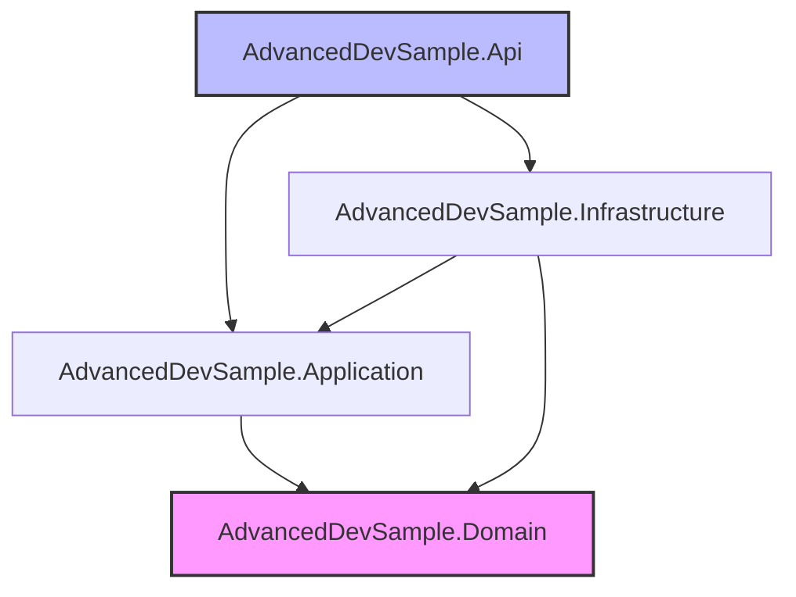

# Architecture du Projet

Ce document décrit l'architecture technique de la solution **AdvancedDevSample**. Le projet suit strictement les principes de la **Clean Architecture** (ou Architecture Hexagonale) pour garantir la maintenabilité, la testabilité et l'indépendance vis-à-vis des frameworks.

## Structure de la Solution

La solution est divisée en 4 couches distinctes, chacune ayant une responsabilité unique :

| Projet | Rôle | Description |
| :--- | :--- | :--- |
| **AdvancedDevSample.Domain** | **Cœur du métier** | Contient les Entités, Value Objects, et Interfaces du Domaine. Aucune dépendance externe. |
| **AdvancedDevSample.Application** | **Cas d'utilisation** | Orchestre la logique métier (Services, DTOs). Dépend uniquement du Domaine. |
| **AdvancedDevSample.Infrastructure** | **Détails techniques** | Implémente les interfaces (EF Core, JWT, Repositories). Dépend de l'Application et du Domaine. |
| **AdvancedDevSample.Api** | **Point d'entrée** | Expose les endpoints REST. Configure l'injection de dépendances. Dépend de tout le monde. |

## Pourquoi la Clean Architecture ?

1.  **Indépendance des Frameworks** : Le cœur du métier (Domain) ne connait pas la base de données (EF Core) ni le Web (ASP.NET).
2.  **Testabilité** : La logique métier peut être testée unitairement sans lancer de base de données ou de serveur web.
3.  **Flexibilité** : On peut changer de base de données (ex: SQLite -> SQL Server) sans toucher au code métier, juste en modifiant l'Infrastructure.

## Diagramme de Dépendances

Le diagramme ci-dessous illustre le sens des dépendances entre les projets. Remarquez que **tout pointe vers le Domaine**, qui est le centre de l'application.

## Entités du Domaine

Le dossier `Domain/Entities` contient les objets principaux modélisés par le métier.

### 1. Product
Représente un produit vendable dans le système.
- **Id** : Identifiant unique (GUID).
- **Name** : Nom du produit (non vide).
- **Price** : Value Object représentant le prix (positif).
- **IsActive** : État du produit (Actif/Inactif).

### 2. User
Représente un utilisateur du système pour l'authentification.
- **Id** : Identifiant unique (GUID).
- **Email** : Adresse email (Unique).
- **PasswordHash** : Mot de passe chiffré (Jamais en clair !).