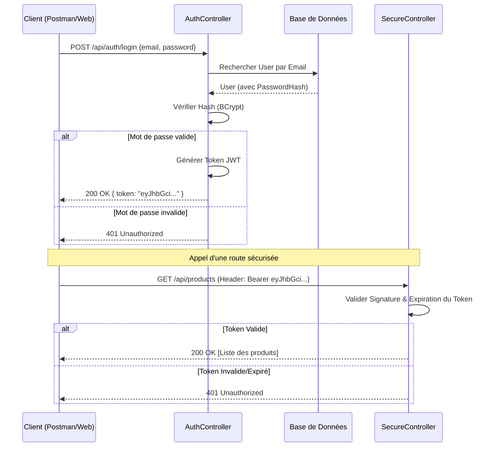

# Authentification et Sécurité

La sécurité de **AdvancedDevSample** repose sur un système d'authentification moderne utilisant **JWT (JSON Web Tokens)** et un stockage sécurisé des mots de passe.

## Vue d'ensemble

- **Standard** : OAuth2 / OpenID Connect (implémentation simplifiée via Bearer Token).
- **Token** : JWT signé avec une clé symétrique (HMACSHA256).
- **Mots de passe** : Hachés avec l'algorithme **BCrypt** avant stockage.

## Configuration Technique (`Program.cs`)

L'API configure la sécurité au démarrage de l'application :

1.  **Schéma d'Authentification** : Défini sur `JwtBearerDefaults.AuthenticationScheme`.
2.  **Validation du Token** :
    - `ValidateIssuer` & `ValidateAudience` : Vérifie que le token vient bien de notre serveur.
    - `ValidateLifetime` : Vérifie que le token n'a pas expiré.
    - `IssuerSigningKey` : Vérifie la signature cryptographique du token.

## Gestion des Utilisateurs (`AuthController.cs`)

Le contrôleur d'authentification gère deux actions principales :

### 1. Inscription (`/register`)
Lorsqu'un utilisateur s'inscrit :
1.  L'API vérifie si l'email existe déjà.
2.  Le mot de passe est hashé via `BCrypt.Net.BCrypt.HashPassword(password)`.
3.  Seul le **Hash** est sauvegardé en base de données via EF Core.

### 2. Connexion (`/login`)
Lorsqu'un utilisateur se connecte :
1.  L'API récupère l'utilisateur par son email.
2.  Elle compare le mot de passe fourni avec le hash stocké via `BCrypt.Net.BCrypt.Verify()`.
3.  Si valide, un **Token JWT** est généré contenant l'ID et l'Email de l'utilisateur.

## Flux d'Authentification

Le diagramme suivant montre comment un client obtient et utilise un token pour accéder à une ressource protégée.

