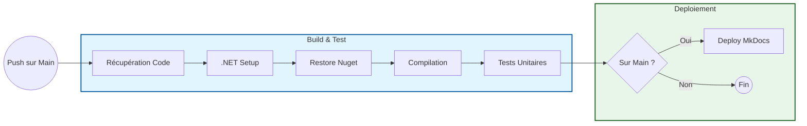
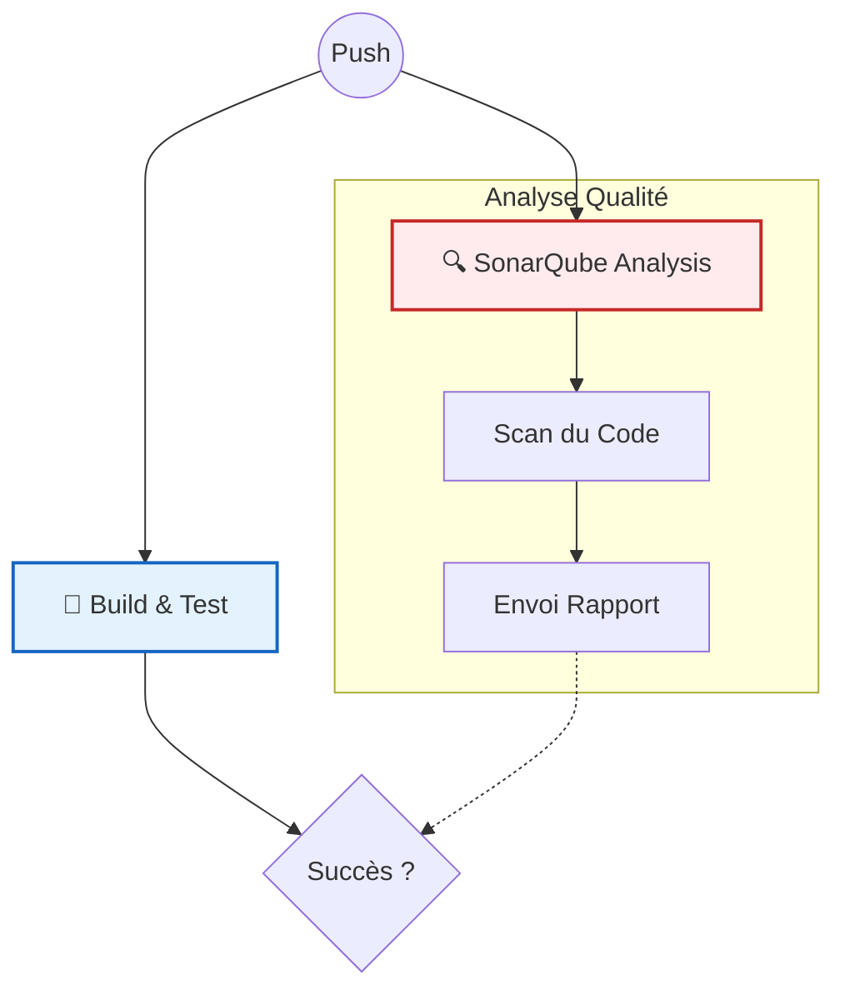

# Guide du Développeur (CI/CD)

Ce guide explique comment fonctionne le pipeline d'intégration continue et comment lancer le projet en local.

## Pipeline CI/CD (`GitHub Actions`)

Le fichier `.github/workflows/ci-cd.yml` définit l'automatisation du projet. Il se déclenche à chaque `push` sur la branche `main`.

### Étapes du Pipeline

Le pipeline est visualisé ci-dessous. Il s'assure que le code est propre avant de déployer la documentation.

## 4. Qualité et Sécurité (SonarQube)

Nous utilisons **SonarQube Cloud** pour analyser la qualité du code en continu. Cet outil détecte les bugs, les vulnérabilités de sécurité et les "Code Smells" (mauvaises pratiques) à chaque modification du code.

### Intégration dans le Pipeline

L'analyse de sécurité tourne en parallèle de la compilation principale pour ne pas ralentir le déploiement.

### Indicateurs de Qualité

Voici les métriques actuelles du projet (Mises à jour manuellement) :

| Métrique | Valeur | État |
| :--- | :--- | :--- |
| **Bugs** | 0 | ✅ PASSED |
| **Vulnérabilités** | 0 | ✅ PASSED |
| **Dette Technique** | < 1h | ✅ PASSED |
| **Code Coverage** | > 80% | 🔄 À vérifier |
| **Code Smells** | 0 | ✅ PASSED |

👉 [Accéder au Dashboard SonarCloud](https://sonarcloud.io/project/overview?id=Syhard87_AdvancedDevSample)
