# Guide du Développeur (CI/CD)

Ce guide explique comment fonctionne le pipeline d'intégration continue et comment lancer le projet en local.

## Pipeline CI/CD (`GitHub Actions`)

Le fichier `.github/workflows/ci-cd.yml` définit l'automatisation du projet. Il se déclenche à chaque `push` sur la branche `main`.

### Étapes du Pipeline

Le pipeline est visualisé ci-dessous. Il s'assure que le code est propre avant de déployer la documentation.

```mermaid
graph LR
    Start((Push sur Main)) --> Checkout
    
    subgraph Build_Test [Build & Test]
        Checkout[Récupération Code] --> Setup[.NET Setup]
        Setup --> Restore[Restore Nuget]
        Restore --> Build[Compilation]
        Build --> Test[Tests Unitaires]
    end

    subgraph Deploy [Deploiement]
        Test --> CheckMain{Sur Main ?}
        CheckMain -- Oui --> DeployDocs[Deploy MkDocs]
        CheckMain -- Non --> Stop((Fin))
    end

    style Build_Test fill:#e1f5fe,stroke:#01579b,stroke-width:2px
    style Deploy fill:#e8f5e9,stroke:#1b5e20,stroke-width:2px
```

## 4. Qualité et Sécurité (SonarQube)

Nous utilisons **SonarQube Cloud** pour analyser la qualité du code en continu. Cet outil détecte les bugs, les vulnérabilités de sécurité et les "Code Smells" (mauvaises pratiques) à chaque modification du code.

### Intégration dans le Pipeline

L'analyse de sécurité tourne en parallèle de la compilation principale pour ne pas ralentir le déploiement.

```mermaid
graph TD;
    Start((Push)) --> Build[🔨 Build & Test];
    Start --> Sonar[🔍 SonarQube Analysis];
    
    subgraph SonarQube [Analyse Qualité]
        Sonar --> Scan[Scan du Code];
        Scan --> Report[Envoi Rapport];
    end

    Build --> Deploy{Succès ?};
    Report -.-> Deploy;
    
    style Sonar fill:#ffebee,stroke:#c62828,stroke-width:2px;
    style Build fill:#e3f2fd,stroke:#1565c0,stroke-width:2px;
```

### Indicateurs de Qualité

Voici les métriques actuelles du projet (Mises à jour manuellement) :

| Métrique | Valeur | État |
| :--- | :--- | :--- |
| **Bugs** | 0 | ✅ PASSED |
| **Vulnérabilités** | 0 | ✅ PASSED |
| **Dette Technique** | < 1h | ✅ PASSED |
| **Code Coverage** | > 80% | 🔄 À vérifier |
| **Code Smells** | 0 | ✅ PASSED |

👉 [Accéder au Dashboard SonarCloud](https://sonarcloud.io/project/overview?id=Syhard87_AdvancedDevSample)
